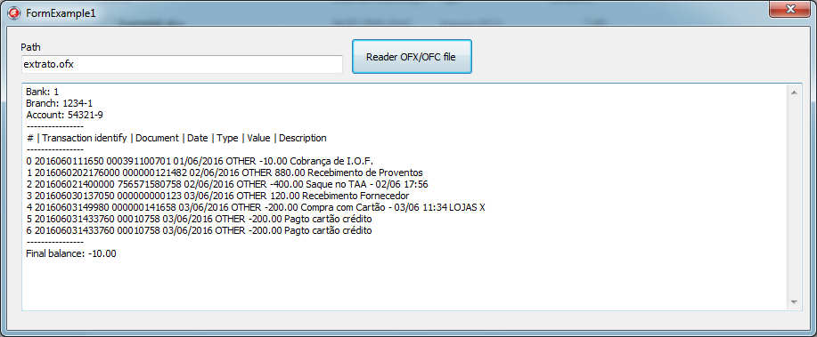
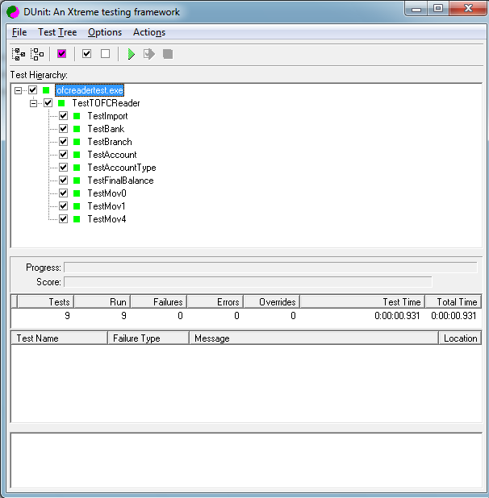

# OFC Reader
Read the OFC (Open Financial Connectivity) file format

About
-------

   * Import the OFC file allows to save time in financial management. Instead of typing or throw each drive manually, you download the current account statement or savings in this file format.

   * OFC file format is widely used in Internet Banking of the leading financial institutions in the world.

   * Compatible with all versions of Delphi / Lazarus.
  
Example
-------

Unittest
-------

License
-------

[The MIT License](LICENSE).
