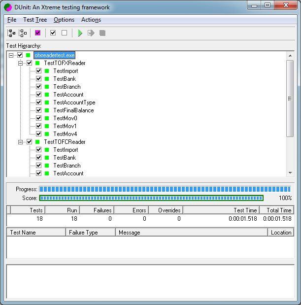

# OFX/OFC Reader
Read the OFX (Open Financial Exchange) and OFC (Open Financial Connectivity) file formats.

About
-------

   * Import the OFX/OFC file allows to save time in financial management. Instead of typing or throw each drive manually, you download the current account statement or savings in this file format.

   * OFX/OFC file format is widely used in Internet Banking of the leading financial institutions in the world.

   * Compatible with all versions of Delphi / Lazarus. 
   
   * Tested with free [Delphi](https://www.embarcadero.com/products/delphi/starter/promotional-download) Starter Edition.
 
Example
-------

Unittest
-------

Colaboration
-------

Contribute to improve the project. If you'd like inspiration on projects to take on, check out the [Easy-Fix](https://github.com/leogregianin/ofx-reader/issues) label on the tracker. It holds tasks that can be solved without too much prior knowledge of the code.

Contributors
-------

Contributors are listed [here](https://github.com/leogregianin/ofx-reader/graphs/contributors).

License
-------

[The MIT License](LICENSE).
