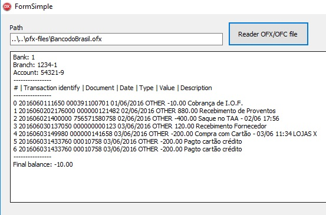
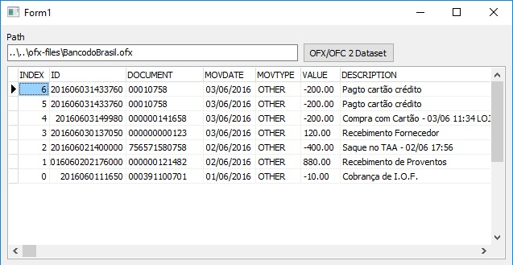
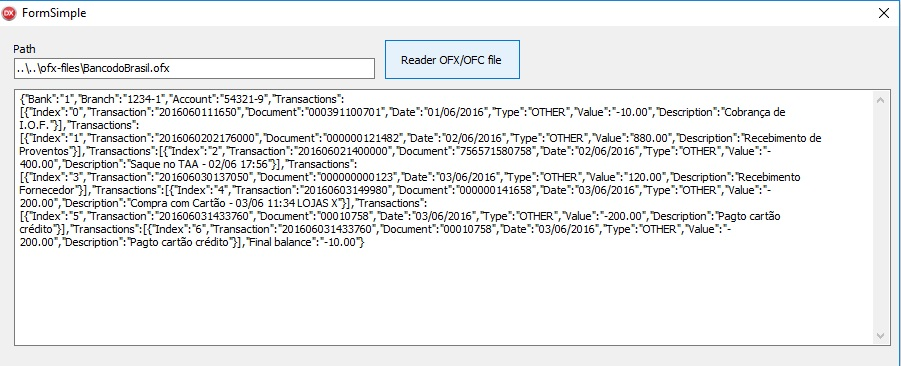
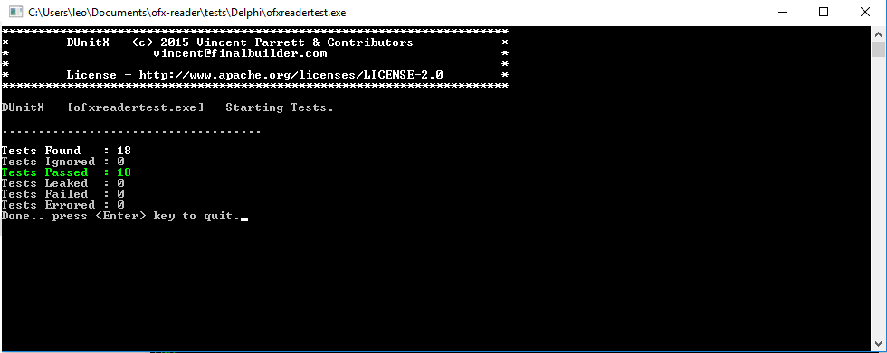

# OFX/OFC Reader
[](https://github.com/leogregianin/ofx-reader/issues?q=is%3Aissue+is%3Aclosed)

Read the OFX (Open Financial Exchange) and OFC (Open Financial Connectivity) file formats.


## Sponsor

<a href="https://www.buymeacoffee.com/leogregianin" target="_blank"></a>


About
-------

   * Import the OFX/OFC file allows to save time in financial management. Instead of typing or throw each drive manually, you download the current account statement or savings in this file format.

   * OFX/OFC file format is widely used in Internet Banking of the leading financial institutions in the world.

   * Compatible with all versions of Delphi / Lazarus. 
   
   * Tested with [Delphi Community Edition](https://www.embarcadero.com/products/delphi/starter/promotional-download) and [Lazarus FPC IDE](https://www.lazarus-ide.org).
 
Instalation (optional)
-------
For install in your project using [boss](https://github.com/HashLoad/boss):
``` sh
$ boss install github.com/leogregianin/ofx-reader
``` 
 
Example
-------

Simple result:




Dataset result:




JSON result:




Unittest
-------




Colaboration
-------

Contribute to improve the project. If you'd like inspiration on projects to take on, check out the [Easy-Fix](https://github.com/leogregianin/ofx-reader/issues) label on the tracker. It holds tasks that can be solved without too much prior knowledge of the code.


Contributors
-------

Contributors are listed [here](https://github.com/leogregianin/ofx-reader/graphs/contributors).


License
-------

[MIT License](LICENSE).
