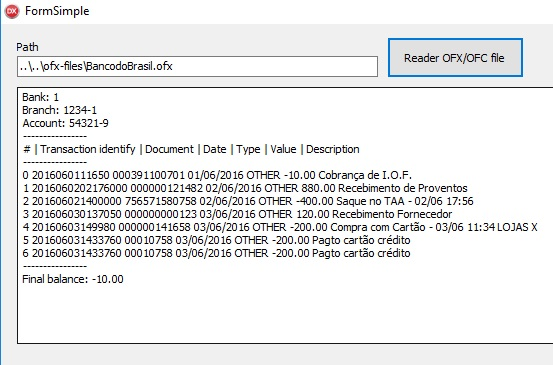
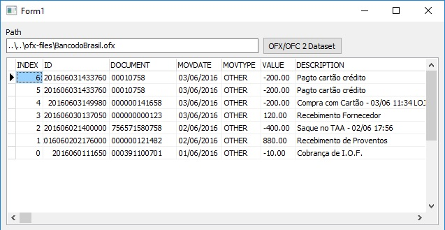
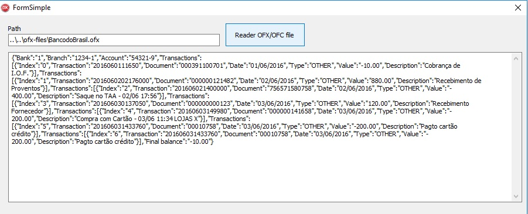

# OFX/OFC/CSV Reader
Read OFX (Open Financial Exchange), OFC (Open Financial Connectivity), and CSV bank statement files.


About
-------

   * Importing OFX, OFC, or CSV files allows you to save time in financial management. Instead of typing each transaction manually, you import the statement downloaded from the bank.

   * OFX/OFC file format is widely used in Internet Banking of the leading financial institutions in the world.

   * Compatible with all versions of Delphi / Lazarus. 
   
   * Tested with [Delphi Community Edition](https://www.embarcadero.com/products/delphi/starter/promotional-download) and [Lazarus FPC IDE](https://www.lazarus-ide.org).
 
Installation (optional)
-------
For install in your project using [boss](https://github.com/HashLoad/boss):
``` sh
$ boss install github.com/leogregianin/ofx-reader
``` 
 
Example
-------

`TOFXReader.Import` detects CSV files by their `.csv` extension, so consumers use the same reader API for every supported format:

```pascal
Reader.OFXFile := 'statement.csv';
if Reader.Import then
  for I := 0 to Reader.Count - 1 do
    ProcessTransaction(Reader.Get(I));
```

CSV parsing is implemented in the separate `src/uExtratoCsvReader.pas` unit and exposed through `TOFXReader`. It supports quoted fields, comma/semicolon/tab delimiters, UTF-8, UTF-16 and Windows-1252 text, Brazilian and international numeric formats, and common bank-statement column names. CSV support currently targets Delphi builds; OFX/OFC support remains available to Lazarus/FPC consumers.

Simple result:




Dataset result:




JSON result:




Unittest
-------

The Delphi tests (`tests/Delphi`) require [DUnitX](https://github.com/VSoftTechnologies/DUnitX), bundled with Delphi since 10 Seattle. Open `tests/Delphi/ofxreadertest.dproj`, or compile it with `dcc32`/`dcc64`, and run the resulting executable.

```
DUnitX - [ofxreadertest.exe] - Starting Tests.

............................................................................

Tests Found   : 38
Tests Ignored : 0
Tests Passed  : 38
Tests Leaked  : 0
Tests Failed  : 0
Tests Errored : 0
```


Collaboration
-------

Contribute to improving the project. If you'd like inspiration on projects, check out the [Easy-Fix](https://github.com/leogregianin/ofx-reader/issues) label on the tracker. It holds tasks that can be solved without too much knowledge of the code.


Contributors
-------

Contributors are listed [here](https://github.com/leogregianin/ofx-reader/graphs/contributors).


License
-------

[MIT License](LICENSE).
